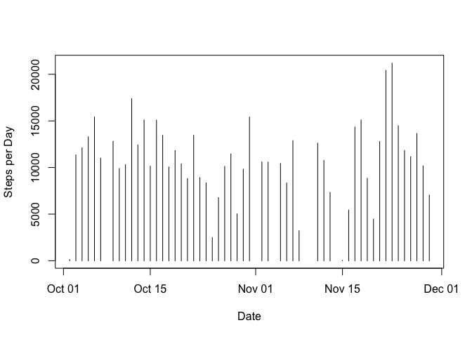
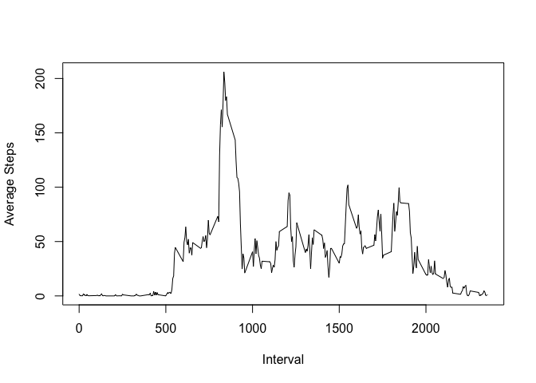
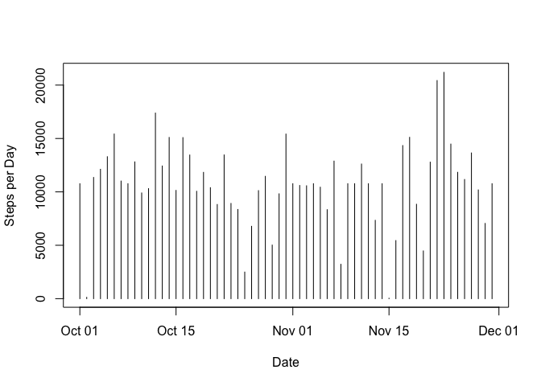
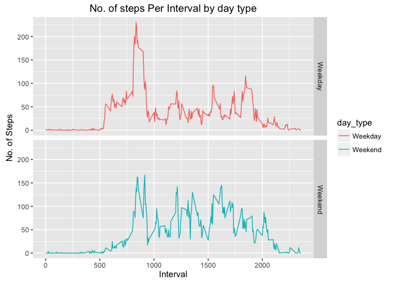

# Reproducible Research: Peer Assessment 1


## Loading and preprocessing the data

```r
data <- read.csv("activity.csv", header = TRUE, sep = ",")
subData <- na.omit(data)
```

## What is mean total number of steps taken per day?
1.Calculate the total number of steps taken per day

```r
daysteps <- aggregate(subData$steps, by=list(date=subData$date), FUN=sum)
```
2.If you do not understand the difference between a histogram and a barplot, research the difference between them. Make a histogram of the total number of steps taken each day

```r
daysteps$date <- as.Date(daysteps$date, "%Y-%m-%d")
plot(daysteps$date,daysteps$x, type = "h", ylab = "Steps per Day", xlab = "Date")
```

<!-- -->

3.Calculate and report the mean and median of the total number of steps taken per day

```r
meansteps <- mean(daysteps$x)
cat("Mean Steps per Day = ", meansteps)
```

```
## Mean Steps per Day =  10766.19
```

```r
mediansteps <- mean(daysteps$x)
cat("Median Steps per Day = ", mediansteps)
```

```
## Median Steps per Day =  10766.19
```
## What is the average daily activity pattern?
1.Make a time series plot of the 5-minute interval (x-axis) and the average number of steps taken, averaged across all days (y-axis)

```r
averageIntervalSteps <- aggregate(subData$steps, by=list(interval=subData$interval), FUN=mean)
plot(averageIntervalSteps$interval,averageIntervalSteps$x, type = "l", ylab = "Average Steps", xlab = "Interval")  
```

<!-- -->

2.Which 5-minute interval, on average across all the days in the dataset, contains the maximum number of steps?

```r
max5minIntervalRow <- which.max(averageIntervalSteps$x)
max5minInterval <- averageIntervalSteps[max5minIntervalRow,"interval"]
cat("Interval of max average steps = ", max5minInterval)
```

```
## Interval of max average steps =  835
```
## Imputing missing values
1.Calculate and report the total number of missing values in the dataset

```r
cat("Total number of missing values = ", sum(is.na(data$steps)))
```

```
## Total number of missing values =  2304
```
2.Create a new dataset that is equal to the original dataset but with the missing data filled in.

```r
data_no_na <- data
data_no_na$date <- as.Date(data_no_na$date, "%Y-%m-%d")
na_index <- which(is.na(data_no_na$steps))
for(counter in na_index){
  temp <- data_no_na[counter, "interval"]
  data_no_na[counter, "steps"] <- averageIntervalSteps[averageIntervalSteps$interval == temp,"x"]
}
```
3.Make a histogram of the total number of steps taken each day and Calculate and report the mean and median total number of steps taken per day. Do these values differ from the estimates from the first part of the assignment? What is the impact of imputing missing data on the estimates of the total daily number of steps?

```r
daysteps_no_na <- aggregate(data_no_na$steps, by=list(date=data_no_na$date), FUN=sum)
plot(daysteps_no_na$date,daysteps_no_na$x, type = "h", ylab = "Steps per Day", xlab = "Date")
```

<!-- -->

```r
meansteps_no_na <- mean(daysteps_no_na$x)
cat("Mean Steps per Day = ", meansteps_no_na)
```

```
## Mean Steps per Day =  10766.19
```

```r
cat("Previous Mean Steps per Day = 10766.19")
```

```
## Previous Mean Steps per Day = 10766.19
```

```r
mediansteps_no_na <- mean(daysteps_no_na$x)
cat("Median Steps per Day = ", mediansteps_no_na)
```

```
## Median Steps per Day =  10766.19
```

```r
cat("Previous Median Steps per Day = 10765")
```

```
## Previous Median Steps per Day = 10765
```
Missing value is not changing the estimation
The shape of the histogram remains the same while the frequency counts increased
## Are there differences in activity patterns between weekdays and weekends?
1.Create a new factor variable in the dataset with two levels – “weekday” and “weekend” indicating whether a given date is a weekday or weekend day.

```r
week_day <- function(date_val) {
  wd <- weekdays(as.Date(date_val, '%Y-%m-%d'))
  if  (!(wd == 'Saturday' || wd == 'Sunday')) {
    x <- 'Weekday'
  } else {
    x <- 'Weekend'
  }
  x
}
data_no_na$day_type <- as.factor(sapply(data_no_na$date, week_day))
```
2.Make a panel plot containing a time series plot of the 5-minute interval (x-axis) and the average number of steps taken, averaged across all weekday days or weekend days (y-axis). See the README file in the GitHub repository to see an example of what this plot should look like using simulated data.

```r
library(ggplot2)
steps_per_day_impute <- aggregate(steps ~ interval+day_type, data_no_na, mean)
plt <- ggplot(steps_per_day_impute, aes(interval, steps)) +
  geom_line(stat = "identity", aes(colour = day_type)) +
  theme_gray() +
  facet_grid(day_type ~ ., scales="fixed", space="fixed") +
  labs(x="Interval", y=expression("No. of Steps")) +
  ggtitle("No. of steps Per Interval by day type")
print(plt)
```

<!-- -->
